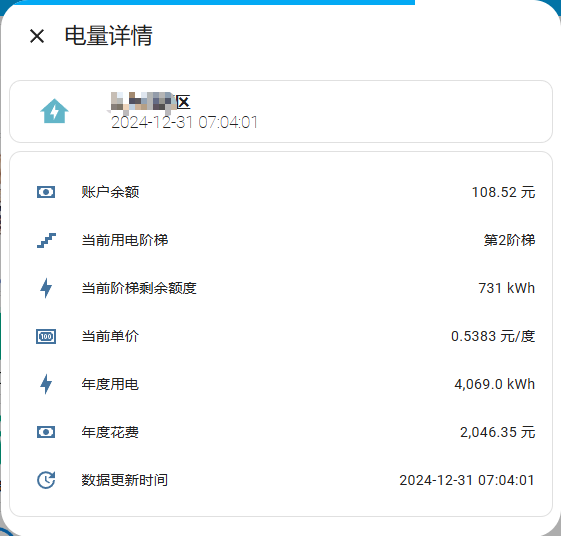
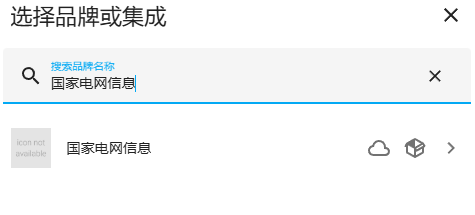
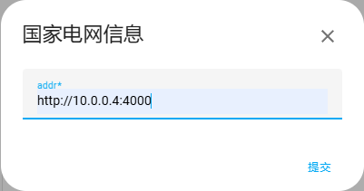

# ⚡️国家电网电力获取

## 简介
本项目是将项目[sgcc_electricity_web](https://github.com/Javedhd/sgcc_electricity_web)的接口信息转换为HomeAssistant的实体


## 安装与部署
### 手动安装
1. 下载代码
``` sh
git clone https://github.com/Javedhd/sgcc_electricity_client.git
```

2. 复制文件到HomeAssistant
上传custom_components目录下的文件夹sgcc_electricity_client到HomeAssistant的custom_components目录下

3. 重启HomeAssistant

## 配置sgcc_electricity_client
1. HomeAssistant中打开设置->设备与服务->添加集成
2. 搜索“国家电网信息”

3. 配置sgcc_electricity_web的服务地址

4. 点击提交

## 实体介绍
|实体id|实体名称|说明|
|-|-|-|
|sensor.electricity_***_year_ele_cost|年度累计电费|今年总用电费用，单位：元|
|sensor.electricity_***_year_ele_num|年度累计用电|今年总用电量，单位：KWH、度|
|sensor.electricity_***_last_month_ele_cost|上个月电费|上个月用电量，单位：KWH、度|
|sensor.electricity_***_last_month_ele_num|上个月用电|上个月用电费用，单位元|
|sensor.electricity_***_balance|账户余额|账号当前余额，单位：元|
|sensor.electricity_***_refresh_time|最近刷新时间|数据最后一次成功更新的时间|


### Buy Me a Coffee

<p align="center">
    
    
</p>